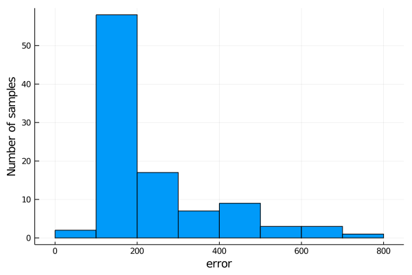

# Estimating ancestry

If samples in the reference haplotype panel are labeled with a population origin, MendelImpute can also be used for:

+ Estimate admixed proportions
+ Chromosome painting


```julia
# first load all necessary packages
using MendelImpute
using VCFTools
using GeneticVariation
using Random
using DataFrames
using Plots
using JLSO
using CSV
```

## Data preparation

### Step 1. Filter chromosome data 

We use the [1000 genomes chromosome 22](http://bochet.gcc.biostat.washington.edu/beagle/1000_Genomes_phase3_v5a/b37.vcf/) as illustration.  The original data is filtered into target and reference panels. Follow [detailed example](https://openmendel.github.io/MendelImpute.jl/dev/man/Phasing+and+Imputation/#Detailed-Example) in Phasing and Imputation to obtain the same data.


!!! note

    In practice, it is better to infer ancestry of admixed populations using non-admixed reference populations. The example here is a simplified illustration and should not be taken too literally. 


### Step 2. Process each sample's population origin

MendelImpute needs to know each reference sample's origin (country/ethnicity/region...etc). This origin information should be provided by the reference haplotype panel, but users are free to further organize origin labels base on their own criteria. As in our paper, we use super-populations. 

To do so, we need to create a `Dict{key, value}` where each key is a sample ID and the value is the population code. This will be used for both the [paint](https://openmendel.github.io/MendelImpute.jl/dev/man/api/#MendelImpute.paint) and [composition](https://openmendel.github.io/MendelImpute.jl/dev/man/api/#MendelImpute.composition) function.


```julia
# map population to super-population
pop_to_superpop = Dict{String, String}()

# 5 east asian
pop_to_superpop["CHB"] = "EAS"; pop_to_superpop["JPT"] = "EAS"; pop_to_superpop["CHS"] = "EAS"; 
pop_to_superpop["CDX"] = "EAS"; pop_to_superpop["KHV"] = "EAS"; 

# 5 european
pop_to_superpop["CEU"] = "EUR"; pop_to_superpop["TSI"] = "EUR"; pop_to_superpop["FIN"] = "EUR";
pop_to_superpop["GBR"] = "EUR"; pop_to_superpop["IBS"] = "EUR";

# 7 african
pop_to_superpop["YRI"] = "AFR"; pop_to_superpop["LWK"] = "AFR"; pop_to_superpop["GWD"] = "AFR"; 
pop_to_superpop["MSL"] = "AFR"; pop_to_superpop["ESN"] = "AFR"; pop_to_superpop["ASW"] = "AFR"; 
pop_to_superpop["ACB"] = "AFR"; 

# 4 ad mixed americans
pop_to_superpop["MXL"] = "AMR"; pop_to_superpop["PUR"] = "AMR"; pop_to_superpop["CLM"] = "AMR"; 
pop_to_superpop["PEL"] = "AMR";

# 5 south asian
pop_to_superpop["GIH"] = "SAS"; pop_to_superpop["PJL"] = "SAS"; pop_to_superpop["BEB"] = "SAS"; 
pop_to_superpop["STU"] = "SAS"; pop_to_superpop["ITU"] = "SAS";
```


```julia
# read population origin into a dataframe
file = joinpath(normpath(MendelImpute.datadir()), "1000genomes.population.txt")
df = CSV.read(file, DataFrame)

# create dictionary with key = ID, value = population 
refID_to_population = Dict{String, String}()
refID_to_superpopulation = Dict{String, String}()
for (id, population) in eachrow(df)
     refID_to_population[id] = population
     refID_to_superpopulation[id] = pop_to_superpop[population]
end
refID_to_superpopulation
```


    Dict{String,String} with 2504 entries:
      "HG01791" => "EUR"
      "HG02736" => "SAS"
      "HG00182" => "EUR"
      "HG03914" => "SAS"
      "HG00149" => "EUR"
      "NA12156" => "EUR"
      "HG02642" => "AFR"
      "HG02851" => "AFR"
      "NA19835" => "AFR"
      "NA19019" => "AFR"
      "HG01131" => "AMR"
      "HG03578" => "AFR"
      "NA18550" => "EAS"
      "HG02401" => "EAS"
      "HG01350" => "AMR"
      "HG03973" => "SAS"
      "NA07000" => "EUR"
      "HG01709" => "EUR"
      "HG01395" => "AMR"
      "HG01980" => "AMR"
      "HG01979" => "AMR"
      "HG01122" => "AMR"
      "HG03869" => "SAS"
      "HG03729" => "SAS"
      "NA19920" => "AFR"
      ⋮         => ⋮


Note the [population codes](ftp://ftp.1000genomes.ebi.ac.uk/vol1/ftp/data_collections/1000_genomes_project/data/) for 1000 genome's samples are explained [here](https://www.internationalgenome.org/category/population/). 

### Step 3. Compute phase information using MendelImpute

This is equivalent to running a typical imputation. Please ensure that:
+ The output file name ends with `.jlso` (save output to ultra-compressed format)
+ `impute = true` (so the output contains the entire chromosome)

Note data used here is prepared in [Detailed Example](https://openmendel.github.io/MendelImpute.jl/dev/man/Phasing+and+Imputation/#Detailed-Example).


```julia
# compute each person's phase information
tgtfile = "target.chr22.typedOnly.masked.vcf.gz"
reffile = "ref.chr22.maxd1000.excludeTarget.jlso"
outfile = "mendel.imputed.jlso"
@time ph = phase(tgtfile, reffile, outfile);
```

    Number of threads = 1
    Importing reference haplotype data...


    Computing optimal haplotypes...100%|████████████████████| Time: 0:00:28
    Phasing...100%|█████████████████████████████████████████| Time: 0:00:05


    Total windows = 1634, averaging ~ 508 unique haplotypes per window.
    
    Timings: 
        Data import                     = 13.8493 seconds
            import target data             = 3.61007 seconds
            import compressed haplotypes   = 10.2393 seconds
        Computing haplotype pair        = 28.5288 seconds
            BLAS3 mul! to get M and N      = 1.20264 seconds per thread
            haplopair search               = 22.9585 seconds per thread
            initializing missing           = 0.121591 seconds per thread
            allocating and viewing         = 0.337528 seconds per thread
            index conversion               = 0.014748 seconds per thread
        Phasing by win-win intersection = 5.92058 seconds
            Window-by-window intersection  = 0.581821 seconds per thread
            Breakpoint search              = 4.05849 seconds per thread
            Recording result               = 0.146574 seconds per thread
        Imputation                     = 3.65652 seconds
            Imputing missing               = 0.0221378 seconds
            Writing to file                = 3.63439 seconds
    
        Total time                      = 52.1137 seconds
    
     58.377736 seconds (96.50 M allocations: 5.471 GiB, 4.24% gc time)


## Estimate admixture proportions

+ The [composition](https://openmendel.github.io/MendelImpute.jl/dev/man/api/#MendelImpute.composition) will compute a list of percentages where `composition[i]` equals the sample's ancestry (in %) from `populations[i]`.
+ This illustration depends on **data preparation** above. 

### Step 1: import necessary data


```julia
# First import compressed reference panel
reffile = "ref.chr22.maxd1000.excludeTarget.jlso"
compressed_Hunique = MendelImpute.read_jlso(reffile)
panelID = compressed_Hunique.sampleID

# also need target sample's ancestry
tgtfile = "target.chr22.typedOnly.masked.vcf.gz"
reader = VCF.Reader(openvcf(tgtfile, "r"))
tgtID  = VCF.header(reader).sampleID
sample_population = [refID_to_population[id] for id in tgtID]
sample_superpopulation = [refID_to_superpopulation[id] for id in tgtID];
```


```julia
# here is each sample's super-population (sample 1 is EUR, sample 3 is EAS...etc)
sample_superpopulation
```


    100-element Array{String,1}:
     "EUR"
     "EUR"
     "EAS"
     "EAS"
     "EAS"
     "EAS"
     "AMR"
     "AMR"
     "AMR"
     "AMR"
     "EUR"
     "AMR"
     "EUR"
     ⋮
     "AMR"
     "AFR"
     "AFR"
     "EUR"
     "EUR"
     "EUR"
     "EUR"
     "EUR"
     "EUR"
     "EUR"
     "SAS"
     "SAS"


### Step 2: call `composition` function

+ The [composition](https://openmendel.github.io/MendelImpute.jl/dev/man/api/#MendelImpute.composition) will compute a list of percentages where `composition[i]` equals the sample's ancestry (in %) from `populations[i]`.
+ We are finally using the imputation result stored in `ph`.


```julia
populations = MendelImpute.unique_populations(refID_to_superpopulation)
@time sample1_comp = composition(ph[1], panelID, refID_to_superpopulation) # origin GBR (EUR)
@time sample4_comp = composition(ph[4], panelID, refID_to_superpopulation) # origin CHS (EAS)
@time sample84_comp = composition(ph[84], panelID, refID_to_superpopulation) # origin LWK (AFR)

println("sample 1 = ", round(sample1_comp[1], digits=3), " S. asian")
println("sample 1 = ", round(sample1_comp[2], digits=3), " E. asian")
println("sample 1 = ", round(sample1_comp[3], digits=3), " European")
println("sample 1 = ", round(sample1_comp[4], digits=3), " Admixed-American")
println("sample 1 = ", round(sample1_comp[5], digits=3), " Africans\n")

println("sample 4 = ", round(sample4_comp[1], digits=3), " S. asian")
println("sample 4 = ", round(sample4_comp[2], digits=3), " E. asian")
println("sample 4 = ", round(sample4_comp[3], digits=3), " European")
println("sample 4 = ", round(sample4_comp[4], digits=3), " Admixed-American")
println("sample 4 = ", round(sample4_comp[5], digits=3), " Africans\n")
    
println("sample 84 = ", round(sample84_comp[1], digits=3), " S. asian")
println("sample 84 = ", round(sample84_comp[2], digits=3), " E. asian")
println("sample 84 = ", round(sample84_comp[3], digits=3), " European")
println("sample 84 = ", round(sample84_comp[4], digits=3), " Admixed-American")
println("sample 84 = ", round(sample84_comp[5], digits=3), " Africans");
```

      0.003909 seconds (26 allocations: 2.000 KiB)
      0.000167 seconds (6 allocations: 544 bytes)
      0.000185 seconds (6 allocations: 544 bytes)
    sample 1 = 0.652 S. asian
    sample 1 = 0.088 E. asian
    sample 1 = 0.023 European
    sample 1 = 0.17 Admixed-American
    sample 1 = 0.067 Africans
    
    sample 4 = 0.189 S. asian
    sample 4 = 0.061 E. asian
    sample 4 = 0.01 European
    sample 4 = 0.053 Admixed-American
    sample 4 = 0.687 Africans
    
    sample 84 = 0.065 S. asian
    sample 84 = 0.014 E. asian
    sample 84 = 0.784 European
    sample 84 = 0.111 Admixed-American
    sample 84 = 0.025 Africans


Here `sample1_comp[i]` equals the sample's estimated ancestry (in %) from `populations[i]`. 

**Conclusion:** We computed the population percentages for sample 1, 4, and 84 with respect to the 5 reference super populations. Thus sample 1 is 65% European, 10% South Asian, 20% American...etc. Sample 4 is 20% European, 70% East Asian,...etc. Sample 84 is 80% African and 5% European...etc. 

## Chromosome painting

The main function is the [paint](https://openmendel.github.io/MendelImpute.jl/dev/man/api/#MendelImpute.paint) function. For an imputed sample, it will convert **each haplotype segment** into a percentage indicating the segment's length in the chromosome. Then the list can be used for easy plotting. 

**Note:** this illustration depends on **data preparation** above. 

### Step 1: Choose your colors

In this example, colors are arranged such that:
+ Blue ≈ European/American
+ Red ≈ South/East Asian
+ Green ≈ African

Of course, Julia lets you plot your favoriate colors. We pick our colors here: https://mdigi.tools/color-shades/#008000.


```julia
continent = ["SAS", "EAS", "EUR", "AMR", "AFR"]
continent_colors = [colorant"#e6194B", colorant"#800000", colorant"#4363d8", colorant"#0000b3", colorant"#bfef45"]
```





### Step 2: Run `paint` funcion

This function convert the imputed haplotype segments into a list of percentages (one list for each strand). This is simply a post-processing routine so that data can be used for easy plotting later.


```julia
populations = unique_populations(refID_to_superpopulation)
@time sample1_s1_comp, sample1_s2_comp = paint(ph[1], panelID, refID_to_superpopulation, populations=populations)
@time sample4_s1_comp, sample4_s2_comp = paint(ph[4], panelID, refID_to_superpopulation, populations=populations)
@time sample84_s1_comp, sample84_s2_comp = paint(ph[84], panelID, refID_to_superpopulation, populations=populations);
```

      0.072840 seconds (122.95 k allocations: 6.250 MiB)
      0.000099 seconds (12 allocations: 19.906 KiB)
      0.000104 seconds (12 allocations: 22.406 KiB)


### Step 3: Generate plots for painted chromosomes

We found the [StatsPlots.jl](https://github.com/JuliaPlots/StatsPlots.jl) package to be more useful for this purpose, although the code below still did the plotting in a very roundabout way. 


```julia
using StatsPlots, FixedPointNumbers

# assign a color to each haplotype segment
sample1_s1_colors = [continent_colors[findfirst(x -> x == pop, continent)] for pop in sample1_s1_comp[2]]
sample1_s1_colors = reshape(sample1_s1_colors, 1, length(sample1_s1_colors))
sample1_s2_colors = [continent_colors[findfirst(x -> x == pop, continent)] for pop in sample1_s2_comp[2]]
sample1_s2_colors = reshape(sample1_s2_colors, 1, length(sample1_s2_colors))
sample4_s1_colors = [continent_colors[findfirst(x -> x == pop, continent)] for pop in sample4_s1_comp[2]]
sample4_s1_colors = reshape(sample4_s1_colors, 1, length(sample4_s1_colors))
sample4_s2_colors = [continent_colors[findfirst(x -> x == pop, continent)] for pop in sample4_s2_comp[2]]
sample4_s2_colors = reshape(sample4_s2_colors, 1, length(sample4_s2_colors))
sample84_s1_colors = [continent_colors[findfirst(x -> x == pop, continent)] for pop in sample84_s1_comp[2]]
sample84_s1_colors = reshape(sample84_s1_colors, 1, length(sample84_s1_colors))
sample84_s2_colors = [continent_colors[findfirst(x -> x == pop, continent)] for pop in sample84_s2_comp[2]]
sample84_s2_colors = reshape(sample84_s2_colors, 1, length(sample84_s2_colors));

# roundabout code for plotting...
sample1_s1l = length(sample1_s1_comp[1])
sample1_s2l = length(sample1_s2_comp[1])
sample4_s1l = length(sample4_s1_comp[1])
sample4_s2l = length(sample4_s2_comp[1])
sample84_s1l = length(sample84_s1_comp[1])
sample84_s2l = length(sample84_s2_comp[1])
maxlen = max(sample1_s1l, sample1_s2l, sample4_s1l, sample4_s2l, sample84_s1l, sample84_s2l)

mydata = zeros(6, maxlen)
copyto!(@view(mydata[1, 1:sample1_s1l]), sample1_s1_comp[1])
copyto!(@view(mydata[2, 1:sample1_s2l]), sample1_s2_comp[1])
copyto!(@view(mydata[3, 1:sample4_s1l]), sample4_s1_comp[1])
copyto!(@view(mydata[4, 1:sample4_s2l]), sample4_s2_comp[1])
copyto!(@view(mydata[5, 1:sample84_s1l]), sample84_s1_comp[1])
copyto!(@view(mydata[6, 1:sample84_s2l]), sample84_s2_comp[1])

pop_colors = Matrix{RGB{Normed{UInt8,8}}}(undef, 6, maxlen)
copyto!(@view(pop_colors[1, 1:sample1_s1l]), sample1_s1_colors)
copyto!(@view(pop_colors[2, 1:sample1_s2l]), sample1_s2_colors)
copyto!(@view(pop_colors[3, 1:sample4_s1l]), sample4_s1_colors)
copyto!(@view(pop_colors[4, 1:sample4_s2l]), sample4_s2_colors)
copyto!(@view(pop_colors[5, 1:sample84_s1l]), sample84_s1_colors)
copyto!(@view(pop_colors[6, 1:sample84_s2l]), sample84_s2_colors)

xnames = ["Sample 1 hap1", "Sample 1 hap2", "Sample 4 hap1", "Sample 4 hap2", "Sample 84 hap1", "Sample 84 hap2"]
ynames = ["SNP 1", "SNP 208k", "SNP 417k"]

# color haplotypes
chrom_plt2 = groupedbar(mydata, bar_position = :stack, bar_width=0.7, label=:none, 
    lw = 0, color=pop_colors, xticks=(1:1:6, xnames), yticks=(0:0.5:1, ynames),
    ytickfont=font(12), xtickfont=font(12), xrotation=20, right_margin = 35Plots.mm,
    grid=false)

# create a plot for legend
color_x = ones(5)
color_y = collect(1:1:5)
admixture_chrom_plt = scatter!(color_x, color_y, color=reverse(continent_colors), ytick=(1:1:5, reverse(continent)), 
    xrange=(0.9, 1.1), xtick=false, label=:none, markersize=8, ytickfont=font(16),
    grid=false, framestyle=:grid, mirror=true, tick_direction=:out, markershape=:rect,
    inset = (1, bbox(-0.05, 0.0, 0.05, 1.0, :bottom, :right)), subplot = 2)
```


**Conclusion:** 
+ We can visualize the linkage patterns for the 3 samples across their 6 haplotypes
+ Sample 1 is mostly European and admixed American, sample 2 is mainly South/East Asian, and sample 3 is mainly African.

**Note:** this example should not be taken too literally, since we *did not* exclude admixed samples from the reference panel. For more details, please refer to our paper, or file an issue on GitHub. 
