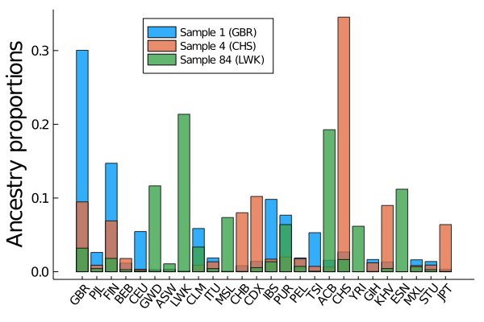
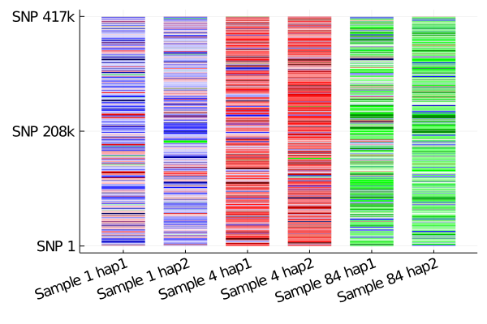

# Estimating ancestry

If samples in the reference haplotype panel are labeled with a population origin, MendelImpute can also be used for:

+ Estimate admixed proportions
+ Chromosome painting

We use the [1000 genomes chromosome 22](http://bochet.gcc.biostat.washington.edu/beagle/1000_Genomes_phase3_v5a/b37.vcf/) as illustration. Example code to generate plots are presented. 


```julia
# first load all necessary packages
using MendelImpute
using VCFTools
using GeneticVariation
using Random
using DataFrames
using Plots
using JLSO
```

## Data preparation

### Step 0. Filter chromosome data 

The original chromosome data are filtered into target and reference panels. Follow [detailed example](https://biona001.github.io/MendelImpute/dev/man/Phasing+and+Imputation/#Detailed-Example) in Phasing and Imputation to obtain the same data.

### Step 1. Get population data

Download [population code](ftp://ftp.1000genomes.ebi.ac.uk/vol1/ftp/data_collections/1000_genomes_project/data/) for each 1000 genomes sample via the command below (note `wget` will probably not work on non-Mac OS). Different population code is explained [here](https://www.internationalgenome.org/category/population/). 


```julia
# run this code in terminal
# wget -r -l3 -N --no-parent ftp://ftp.1000genomes.ebi.ac.uk/vol1/ftp/data_collections/1000_genomes_project/data/
```

For easier processing, copy the country of origin data into a folder called `data`. It should look contain these subfolders (where each population code contains the sample IDs that belong to the population):


```julia
;ls data
```

    ACB
    ASW
    BEB
    CDX
    CEU
    CHB
    CHS
    CLM
    ESN
    FIN
    GBR
    GIH
    GWD
    IBS
    ITU
    JPT
    KHV
    LWK
    MSL
    MXL
    PEL
    PJL
    PUR
    STU
    TSI
    YRI


### Step 2. Process each sample's population origin

The goal here is to create a `Dict{key, value}` where each key is a sample ID and the value is the population code. This will be used for both the [paint](https://biona001.github.io/MendelImpute/dev/man/api/#MendelImpute.paint) and [composition](https://biona001.github.io/MendelImpute/dev/man/api/#MendelImpute.composition) function.

Here the population origin for different samples are encoded in weird subfolder directory way. We process them into the desired dictionary structure.


```julia
df = DataFrame(sample = String[], population = String[])
refID_to_population = Dict{String, String}()
for population in readdir("data/")
    population == ".DS_Store" && continue # skip auxiliary files
    for sample in readdir("data/" * population)
        sample == ".DS_Store" && continue # skip auxiliary files
        push!(df, (sample, population))
        refID_to_population[sample] = population
    end
end
refID_to_population
```


    Dict{String,String} with 2709 entries:
      "HG01791" => "GBR"
      "HG02736" => "PJL"
      "HG00182" => "FIN"
      "HG03914" => "BEB"
      "HG00149" => "GBR"
      "NA12156" => "CEU"
      "HG02642" => "GWD"
      "HG02851" => "GWD"
      "NA19835" => "ASW"
      "NA19019" => "LWK"
      "HG01131" => "CLM"
      "HG03725" => "ITU"
      "HG03578" => "MSL"
      "NA18550" => "CHB"
      "HG02401" => "CDX"
      "HG01350" => "CLM"
      "HG03973" => "ITU"
      "NA07000" => "CEU"
      "HG01709" => "IBS"
      "HG01395" => "PUR"
      "HG02388" => "CDX"
      "HG01980" => "PEL"
      "HG01979" => "PEL"
      "HG01122" => "CLM"
      "HG03869" => "ITU"
      ⋮         => ⋮


### Step 3. Compute phase information using MendelImpute

This is equivalent to running a typical imputation. Please ensure that:
+ The output file name ends with `.jlso` (save output to ultra-compressed format)
+ `impute = true` (so the output contains the entire chromosome)

Note data used here is prepared in [Detailed Example](https://biona001.github.io/MendelImpute/dev/man/Phasing+and+Imputation/#Detailed-Example).


```julia
# compute each person's phase information
tgtfile = "target.chr22.typedOnly.masked.vcf.gz"
reffile = "ref.chr22.maxd1000.excludeTarget.jlso"
outfile = "mendel.imputed.jlso"
@time ph = phase(tgtfile, reffile, outfile=outfile, impute=true, max_d=1000);
```

    Number of threads = 1
    Importing reference haplotype data...


    Computing optimal haplotypes...100%|████████████████████| Time: 0:00:22


    Total windows = 1634, averaging ~ 508 unique haplotypes per window.
    
    Timings: 
        Data import                     = 12.8755 seconds
            import target data             = 3.19177 seconds
            import compressed haplotypes   = 9.68371 seconds
        Computing haplotype pair        = 22.6357 seconds
            BLAS3 mul! to get M and N      = 1.01138 seconds per thread
            haplopair search               = 17.8065 seconds per thread
            initializing missing           = 0.0905452 seconds per thread
            allocating and viewing         = 0.325886 seconds per thread
            index conversion               = 0.0097123 seconds per thread
        Phasing by win-win intersection = 1.2638 seconds
            Window-by-window intersection  = 0.520476 seconds per thread
            Breakpoint search              = 0.231444 seconds per thread
            Recording result               = 0.0500224 seconds per thread
        Imputation                     = 3.0595 seconds
            Imputing missing               = 0.0697154 seconds
            Writing to file                = 2.98979 seconds
    
        Total time                      = 39.9759 seconds
    
     51.214539 seconds (109.80 M allocations: 6.143 GiB, 5.08% gc time)


## Estimate admixture proportions

The [composition](https://biona001.github.io/MendelImpute/dev/man/api/#MendelImpute.composition) will compute a list of percentages where `composition[i]` equals the sample's ancestry (in %) from `populations[i]`. Thus we simply have to plot the result. This illustration depends on **data preparation** above. 

### Step 1: import necessary data


```julia
# First import compressed reference panel
reffile = "ref.chr22.maxd1000.excludeTarget.jlso"
compressed_Hunique = JLSO.load(reffile)[:compressed_Hunique]
panelID = compressed_Hunique.sampleID

# also need target sample's ancestry
tgtfile = "target.chr22.typedOnly.masked.vcf.gz"
reader = VCF.Reader(openvcf(tgtfile, "r"))
tgtID  = VCF.header(reader).sampleID
sample_population = [refID_to_population[id] for id in tgtID];
```


```julia
# here is our sample population (sample 1 is GBR, 4 is CHS, 84 is LWK...etc)
sample_population
```


    100-element Array{String,1}:
     "GBR"
     "FIN"
     "CHS"
     "CHS"
     "CDX"
     "CDX"
     "PUR"
     "PUR"
     "PUR"
     "PUR"
     "GBR"
     "CLM"
     "IBS"
     ⋮
     "MXL"
     "ASW"
     "ASW"
     "TSI"
     "TSI"
     "TSI"
     "TSI"
     "TSI"
     "TSI"
     "TSI"
     "GIH"
     "GIH"


### Step 2: call `composition` function

The [composition](https://biona001.github.io/MendelImpute/dev/man/api/#MendelImpute.composition) will compute a list of percentages where `composition[i]` equals the sample's ancestry (in %) from `populations[i]`. We are finally using the imputation result stored in `ph`.


```julia
populations = MendelImpute.unique_populations(refID_to_population)
@time sample1_comp = composition(ph[1], panelID, refID_to_population) # origin GBR
@time sample4_comp = composition(ph[4], panelID, refID_to_population) # origin CHS
@time sample84_comp = composition(ph[84], panelID, refID_to_population) # origin LWK
```

      0.003716 seconds (28 allocations: 2.719 KiB)
      0.000300 seconds (8 allocations: 1.250 KiB)
      0.000320 seconds (8 allocations: 1.250 KiB)


    26-element Array{Float64,1}:
     0.0320057171449708
     0.004297435185340359
     0.018110277693318744
     0.002775975541728215
     0.0014975185005183258
     0.11653590812346927
     0.010756755592052499
     0.21362083454036596
     0.03346971804515778
     0.004278282270865305
     0.0735579650986016
     0.0003950288610479996
     0.005562724597848649
     0.013571036962730822
     0.0639467932035883
     0.0072230428714049385
     0.0006930960925660357
     0.19267353139042978
     0.01657325630669562
     0.06172744923879136
     0.0003351760033134542
     0.0043297557285170134
     0.1120026526786548
     0.006926172697041593
     0.0027065462267561427
     0.0004273494042246541


### Step 3: Plot the percentages

We computed the population percentages for sample 1, 4, and 84. Here `sample1_comp[i]` equals the sample's estimated ancestry (in %) from `populations[i]`. Thus we simply have to create a bar plot for each:


```julia
barplot = bar(sample1_comp, xticks=(1:1:26, populations), xrotation=50, grid=false, 
    ylabel = "Ancestry proportions", label="Sample 1 (GBR)", alpha=0.8, legend=:top,
    xtickfont=font(10), ytickfont=font(11), legendfont=font(9), yguidefontsize=18)
bar!(barplot, sample4_comp, label="Sample 4 (CHS)", alpha=0.8)
bar!(barplot, sample84_comp, label="Sample 84 (LWK)", alpha=0.8)
```





## Chromosome painting

The main function is the [paint](https://biona001.github.io/MendelImpute/dev/man/api/#MendelImpute.paint) function. For an imputed sample, it will convert **each haplotype segment** into a percentage indicating the segment's length in the chromosome. Then the list can be used for easy plotting. 

**Note:** this illustration depends on **data preparation** above. 

### Step 1: Choose your colors

In this example, colors are arranged such that:
+ Blue ≈ European/American
+ Red ≈ Asian
+ Green ≈ African

Of course, Julia lets you plot your favoriate colors. We pick our colors here: https://mdigi.tools/color-shades/#008000.


```julia
# generated here: https://mdigi.tools/color-shades/#008000
# Blue ≈ European/American, Red ≈ Asian, Green ≈ Africa
goodcolors = [colorant"#c8c8ff", colorant"#ffeaea", colorant"#ffbfbf", colorant"#a4a4ff",
    colorant"#8080ff", colorant"#e3ffe3", colorant"#aaffaa", colorant"#71ff71", 
    colorant"#5b5bff", colorant"#ff9595", colorant"#39ff39", colorant"#ff6a6a",
    colorant"#ff4040", colorant"#3737ff", colorant"#1212ff", colorant"#0000c8", 
    colorant"#0000a4", colorant"#00ff00", colorant"#ff1515", colorant"#00c600", 
    colorant"#ea0000", colorant"#bf0000", colorant"#008e00", colorant"#00005b",
    colorant"#950000", colorant"#6a0000"]
```


### Step 2: Run `paint` funcion

This function convert the imputed haplotype segments into a list of percentages (one list for each strand). This is simply a post-processing routine so that data can be used for easy plotting later.


```julia
populations = unique_populations(refID_to_population)
@time sample1_s1_comp, sample1_s2_comp = paint(ph[1], panelID, refID_to_population)
@time sample4_s1_comp, sample4_s2_comp = paint(ph[4], panelID, refID_to_population)
@time sample84_s1_comp, sample84_s2_comp = paint(ph[84], panelID, refID_to_population);
```

      0.000257 seconds (12 allocations: 19.125 KiB)
      0.000238 seconds (12 allocations: 20.375 KiB)
      0.000253 seconds (12 allocations: 22.875 KiB)


### Step 3: Generate plots for painted chromosomes

We found the [StatsPlots.jl](https://github.com/JuliaPlots/StatsPlots.jl) package to be more useful for this purpose, although the code below still did the plotting in a very roundabout way. 


```julia
# assign a color to each haplotype segment
sample1_s1_colors = [goodcolors[findfirst(x -> x == pop, populations)] for pop in sample1_s1_comp[2]]
sample1_s1_colors = reshape(sample1_s1_colors, 1, length(sample1_s1_colors))

sample1_s2_colors = [goodcolors[findfirst(x -> x == pop, populations)] for pop in sample1_s2_comp[2]]
sample1_s2_colors = reshape(sample1_s2_colors, 1, length(sample1_s2_colors))

sample4_s1_colors = [goodcolors[findfirst(x -> x == pop, populations)] for pop in sample4_s1_comp[2]]
sample4_s1_colors = reshape(sample4_s1_colors, 1, length(sample4_s1_colors))

sample4_s2_colors = [goodcolors[findfirst(x -> x == pop, populations)] for pop in sample4_s2_comp[2]]
sample4_s2_colors = reshape(sample4_s2_colors, 1, length(sample4_s2_colors))

sample84_s1_colors = [goodcolors[findfirst(x -> x == pop, populations)] for pop in sample84_s1_comp[2]]
sample84_s1_colors = reshape(sample84_s1_colors, 1, length(sample84_s1_colors))

sample84_s2_colors = [goodcolors[findfirst(x -> x == pop, populations)] for pop in sample84_s2_comp[2]]
sample84_s2_colors = reshape(sample84_s2_colors, 1, length(sample84_s2_colors));
```


```julia
using StatsPlots, FixedPointNumbers

# some tedious and roundabout routine for making a bad groupedplot
sample1_s1l = length(sample1_s1_comp[1])
sample1_s2l = length(sample1_s2_comp[1])
sample4_s1l = length(sample4_s1_comp[1])
sample4_s2l = length(sample4_s2_comp[1])
sample84_s1l = length(sample84_s1_comp[1])
sample84_s2l = length(sample84_s2_comp[1])
maxlen = max(sample1_s1l, sample1_s2l, sample4_s1l, sample4_s2l, sample84_s1l, sample84_s2l)

mydata = zeros(6, maxlen)
copyto!(@view(mydata[1, 1:sample1_s1l]), sample1_s1_comp[1])
copyto!(@view(mydata[2, 1:sample1_s2l]), sample1_s2_comp[1])
copyto!(@view(mydata[3, 1:sample4_s1l]), sample4_s1_comp[1])
copyto!(@view(mydata[4, 1:sample4_s2l]), sample4_s2_comp[1])
copyto!(@view(mydata[5, 1:sample84_s1l]), sample84_s1_comp[1])
copyto!(@view(mydata[6, 1:sample84_s2l]), sample84_s2_comp[1])

mycolors = Matrix{RGB{Normed{UInt8,8}}}(undef, 6, maxlen)
copyto!(@view(mycolors[1, 1:sample1_s1l]), sample1_s1_colors)
copyto!(@view(mycolors[2, 1:sample1_s2l]), sample1_s2_colors)
copyto!(@view(mycolors[3, 1:sample4_s1l]), sample4_s1_colors)
copyto!(@view(mycolors[4, 1:sample4_s2l]), sample4_s2_colors)
copyto!(@view(mycolors[5, 1:sample84_s1l]), sample84_s1_colors)
copyto!(@view(mycolors[6, 1:sample84_s2l]), sample84_s2_colors)

# axis labels
xnames = ["Sample 1 hap1", "Sample 1 hap2", "Sample 4 hap1", "Sample 4 hap2", "Sample 84 hap1", "Sample 84 hap2"]
ynames = ["SNP 1", "SNP 208k", "SNP 417k"]

# final plot
chrom_plt = groupedbar(mydata, bar_position = :stack, bar_width=0.7, label=:none, 
    lw = 0, color=mycolors, xticks=(1:1:6, xnames), yticks=(0:0.5:1, ynames),
    ytickfont=font(12), xtickfont=font(12), xrotation=20)
```





For more details, please refer to our paper, or file an issue on GitHub. 
